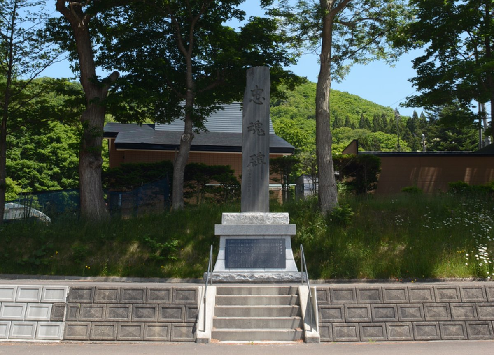
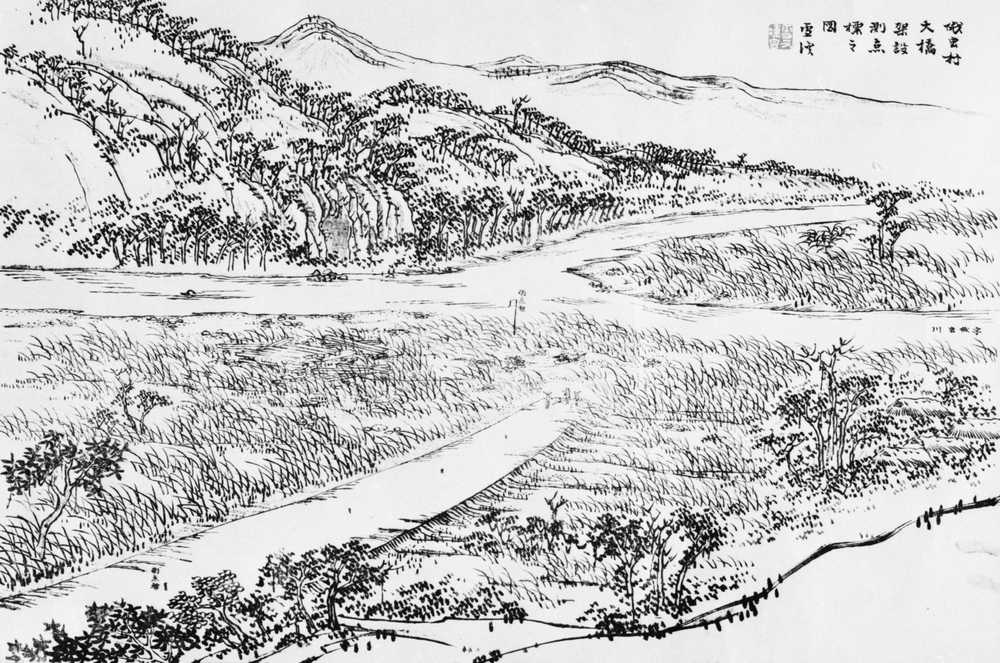
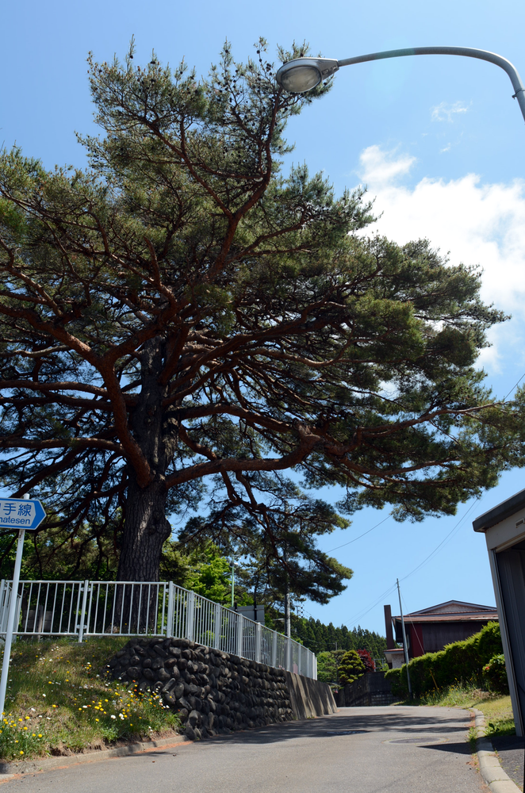

<br>

# 戦没者が帰る場所



<br>

太鼓山登山道へ向かう旧道沿いに忠魂碑は建立されています。かつてこの場所は江差から箱館へ向かう「鶉山道」の入り口でした。厚沢部の市街地や遠く、日本海を望むことができる景勝地です。

大正8年（1919）10月に、在郷軍人厚沢部分会により忠魂碑が建立されました。日清戦争、日露戦争、シベリア出兵などの対外戦争が終結し、世界が平和をめざして協力し合う時代が始まったと考えられていました（国際連盟は翌1920年に結成されます）。

題字の揮毫は陸軍中将田中義一で、厚沢部村の青年会や有志の寄付金によって建てられました。

日中戦争や太平洋戦争の戦没者も合祀され、毎年、戦没者を追悼する慰霊祭が行われています。

<br>

## 明治19年のあっさぶ

明治19年に描かれた『鶉山道図鑑』にはちょうど忠魂碑のあたりから描かれたと思われる図があります。当時の本町周辺にはほとんど人家のない原野が広がっていたようです。



<br>

## 見出しの笠松と鶉山道

忠魂碑の境内に植えられている「見出しの笠松」は、かつての街道の目印でした。明治元年に館城に入城した藩主松前徳広公もこの道を通りました。村民はここで徳広公を出迎えたと言われています。



<br>

# 慰霊祭をふりかえる

毎年8月に忠魂碑の前で行われる慰霊祭は、厚沢部町のもっとも盛大な行事の一つでした。「忠魂碑のお祭り」として大勢の人が集まり、鹿子舞の演舞が行われたこともありました。

<br>

## 大正14年の忠魂碑のお祭り

大正14年撮影といわれる新町商店街の写真です。写真右側に日の丸と幟が掲げられていますが、この位置は忠魂碑の登り口にあたります。今から約100年前の慰霊祭当日の写真と考えられます。


上の写真と同じ日に撮影されたと考えられる本町の通りです。森藤旅館前から函館方面を撮影したものです。日傘をさす女性や通りの右手には氷菓子を売る商店が見え、真夏の厚沢部市街の風景がうかがえます。


<br>

# 厚沢部町内戦没者の戦没位置

<iframe src=kepler.gl.html width="100%" height="480"></iframe>

# 忠魂碑3次元モデル

<div class="sketchfab-embed-wrapper"><iframe width="100%" height="480" src="https://sketchfab.com/models/e84c5a42f6e0441d9e662a958645a446/embed" frameborder="0" allow="autoplay; fullscreen; vr" mozallowfullscreen="true" webkitallowfullscreen="true"></iframe>

<p style="font-size: 13px; font-weight: normal; margin: 5px; color: #4A4A4A;">
    <a href="https://sketchfab.com/3d-models/e84c5a42f6e0441d9e662a958645a446?utm_medium=embed&utm_source=website&utm_campaign=share-popup" target="_blank" style="font-weight: bold; color: #1CAAD9;">厚沢部町忠魂碑</a>
    by <a href="https://sketchfab.com/ishiijunpei?utm_medium=embed&utm_source=website&utm_campaign=share-popup" target="_blank" style="font-weight: bold; color: #1CAAD9;">ishiijunpei</a>
    on <a href="https://sketchfab.com?utm_medium=embed&utm_source=website&utm_campaign=share-popup" target="_blank" style="font-weight: bold; color: #1CAAD9;">Sketchfab</a>
</p>
</div>

<br>
<br>
<br>

<a rel="license" href="http://creativecommons.org/licenses/by/4.0/"></a><br />この 記事 は <a rel="license" href="http://creativecommons.org/licenses/by/4.df0/">クリエイティブ・コモンズ 表示 4.0 国際 ライセンスの下に提供されています。</a>

[](
pandoc index.md -s --self-contained -t html5 -c github.css -o index.html
pandoc -s index.md  -s --self-contained -t html5 -c github.css -o  index.html
)

```{r echo=FALSE,eval=FALSE}
library(knitr)
library(rmarkdown)
render("index.Rmd",html_document(theme =  "cosmo"),"index.html")
```


